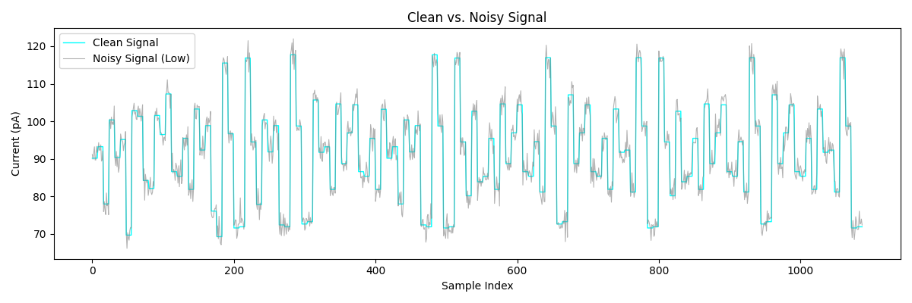
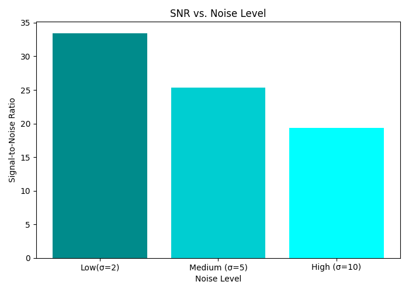
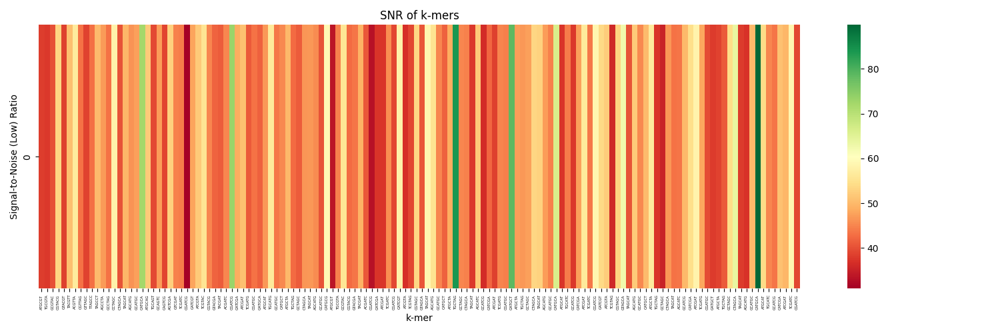
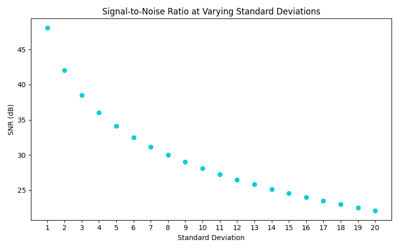

Nanopore Signal Simulation & Noise Analysis

A Python-based simulation of ionic current signals produced by a nanopore sequencer, with noise modeling and signal-to-noise ratio (SNR) analysis. Built as part of a preparation curriculum for a sequencing R&D internship focused on nanopore technology (ONT/Axelios SBX platform).

---

## Background

In nanopore sequencing, DNA is threaded through a protein pore while an ionic current is recorded. The current level at any given moment reflects the **k-mer** (group of bases) occupying the pore — not individual bases. Each unique k-mer produces a characteristic mean current level in picoamperes (pA).

Real nanopore signals are degraded by two primary noise sources:
- **Gaussian (thermal) noise** — random, uncorrelated electronic noise from the recording equipment
- **Flicker (1/f) noise** — slow, correlated baseline drift caused by conformational changes in the pore protein

This project simulates both the clean ground truth signal and its degradation under noise, then quantifies signal quality using SNR analysis.

---

## Project Structure

```
project1_nanopore_signal/
│
├── template_median68pA.model       # ONT 6-mer current level model (4,096 k-mers)
├── main.py                         # Main simulation script
│
├── outputs/
│   ├── Clean_vs_Noisy.png          # Figure 1 — Clean vs noisy signal overlay
│   ├── SNR_vs_Noise.png            # Figure 2 — SNR bar chart (low/medium/high noise)
│   ├── SNR_kmers_low.png           # Figure 3 — Per k-mer SNR heatmap
│   ├── SNR_20Std.png               # Figure 4 — SNR degradation curve (parameter sweep)
│   ├── SNR by kmer                 # CSV — per k-mer SNR values
│   └── SNR by Varying Standard Deviations  # CSV — SNR sweep results
│
└── README.md
```

---

## Dependencies

```
pandas
numpy
matplotlib
seaborn
```

Install with:
```bash
pip install pandas numpy matplotlib seaborn
```

---

## How It Works

### Section 1 — Ground Truth Signal Generation

- Loads a 6-mer ionic current model (`template_median68pA.model`) containing mean current levels for all 4,096 possible 6-mers
- Defines a 150-base DNA sequence and extracts all overlapping 6-mers using a sliding window
- Looks up each k-mer's mean current level from the model
- Expands the signal by a fixed dwell time of 8 samples per k-mer, producing a clean staircase signal in pA

### Section 2 — Noise Injection

Gaussian noise is added at three levels using `np.random.normal(0, sigma, n)`:

| Level  | Sigma (σ) |
|--------|-----------|
| Low    | 2 pA      |
| Medium | 5 pA      |
| High   | 10 pA     |

A fixed random seed (`np.random.seed(42)`) is used for reproducibility.

### Section 3 — SNR Computation

Global SNR is computed using the standard power-based formula:

$$SNR = 10 \cdot \log_{10}\left(\frac{P_{signal}}{P_{noise}}\right)$$

| Noise Level | SNR (dB) |
|-------------|----------|
| Low (σ=2)   | 33.5     |
| Medium (σ=5)| 25.5     |
| High (σ=10) | 19.3     |

Each doubling of noise sigma reduces SNR by approximately 6 dB, consistent with the theoretical relationship between noise power and SNR.

### Section 4 — Visualization

Four plots are produced:

**Figure 1 — Clean vs Noisy Signal**
Overlay of the ground truth staircase signal and the low-noise version. The k-mer plateau structure remains clearly visible at low noise.



**Figure 2 — SNR vs Noise Level**
Bar chart comparing global SNR across the three noise levels.



**Figure 3 — Per K-mer SNR Heatmap**
Each column represents one k-mer position along the DNA sequence. Color encodes SNR — green indicates high SNR (easily distinguishable), red indicates low SNR (difficult to distinguish from noise).



**Figure 4 — SNR Degradation Curve**
Parameter sweep across sigma values 1–20 pA, showing the smooth degradation of global SNR as noise increases.



### Section 5 — Parameter Sweep & Analysis

- Loops over sigma values from 1 to 20 pA
- Computes global SNR at each sigma level
- Exports results as a CSV for further analysis

**Key finding:** The minimum current difference between any two adjacent k-mers in the test sequence is **0.31 pA**, occurring between k-mers `TCGATC` and `CGATCG`. These two k-mers overlap by 5 of 6 bases, making them inherently difficult to distinguish regardless of noise level. This highlights a fundamental challenge in nanopore basecalling — heavily overlapping k-mers produce nearly identical current levels — and contextualizes why technologies like Roche's SBX (Sequencing by Expansion) aim to increase signal separation between bases.

---

## Results Summary

| Metric | Value |
|--------|-------|
| DNA sequence length | 141 bases |
| K-mer size | 6-mer |
| Number of k-mers | 136 |
| Signal range | ~70 – 120 pA |
| SNR at σ=2 | 33.5 dB |
| SNR at σ=5 | 25.5 dB |
| SNR at σ=10 | 19.3 dB |
| Min adjacent k-mer difference | 0.31 pA (TCGATC → CGATCG) |

---

## Key Concepts Demonstrated

- **K-mer signal modeling** — mapping DNA sequence to ionic current via a lookup table
- **Dwell time expansion** — simulating multi-sample residence time per k-mer
- **Gaussian noise injection** — modeling thermal/electronic noise in nanopore recording
- **SNR analysis** — quantifying signal quality in decibels at global and per-k-mer resolution
- **Parameter sweep** — systematic analysis of how SNR degrades with increasing noise
- **Nanopore signal challenges** — identifying k-mer pairs with inherently low separability
